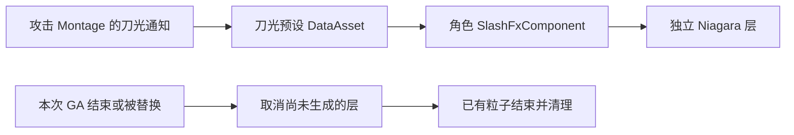

# 长离普攻刀光

当前第一段普攻 `Attack01` 使用导出的四份原网格、17 张原贴图，以及重新制作的可编辑材质和 Niagara。原来的统一弧形网格效果仍用于 `Attack02`～`Attack05`。第一段的几何和图片来自原资源，但母材质计算图、Niagara 发射与运动逻辑尚未完整恢复，因此这一版属于基于原资源的重建，不能称为原作特效的完整还原。

## 游戏内使用

五段普攻 Montage 继续通过 `Wuwa Slash FX` 通知引用各自预设。正常执行现有攻击 GA 即可触发，**无需修改 GA，也无需在 GA 蓝图添加 Spawn 节点**。第一段沿用 `/Game/Effects/ChangliSlash/Presets/DA_Attack01_01`；导入工具更新这个预设的内容，不替换战斗链路。

通知的 `SocketName` 默认是 `Root`，`LocationOffset / RotationOffset / Scale` 是相对该骨骼的变换。第一段重建将四条原通知对应的位置、旋转、缩放和相对延迟放入预设层，通知自身偏移归零，避免重复应用变换。这四层共享三个系统，羽毛系统被放置两次。

打开预设 DataAsset，可以修改每层的 `System`、`Transform`、`DelaySeconds` 和可选 `LocalYawDegrees` 曲线。角色触发时的世界变换会被记录，后续角色移动不会拖着已生成的效果走；带旋转曲线的层仍会在该位置按自己的曲线旋转。



通知只保存配置，运行时状态放在 `UWuwaSlashFxComponent`。组件按本次技能 Handle 记录播放，不决定技能能否执行，也不修改输入缓存、移动或取消窗口。`MaximumLifetime` 是异常残留的安全上限，不是 Montage 长度或粒子寿命；单层寿命由 Niagara 决定。

## 第一段的原数据与重建项

| 内容 | 当前处理 |
|---|---|
| 四份网格 | 从原 PSKX 读取顶点、索引、UV、法线和顶点色，恢复导出时的坐标变换；三份网格保留透明度顶点色，另一份源文件没有色流 |
| 17 张图片 | PNG 原样复制，不重绘、不合并通道；缺少的 `T_DefaultColorWhite_D` 单独生成纯白占位图 |
| Renderer 与材质引用 | 根据实际引用确定四个主 Mesh 层、两个羽毛 Sprite 层和两个次级 Mesh 层 |
| 材质参数、曲线 | 保留已导出的通道向量、UV 参数、颜色等 LUT 与来源；这些数值不等于已恢复原计算图 |
| 母材质 | 基础 Material 图仍缺失，UV 运算、纹理混合、溶解、亮度与透明度组合采用明确标注的重建公式 |
| Niagara 与运动 | 创建 UE 5.7 可编辑系统；发射数量、粒子寿命、空间分布、运动及部分渐隐参数为重建配置。部分网格旋转由原旋转速率 LUT 积分后以材质 WPO 实现，不是恢复了原 Niagara 运动模块图 |
| 曲线采样 | 材质 LUT 当前按粒子归一化年龄采样，并重采样为 24 点；原始采样输入尚未确认。DA 旋转曲线映射为局部 yaw 也是重建选择 |

第一段资源位于 `/Game/Effects/ChangliSlash/Reference`。材质的纹理输入和 `Intensity` 可编辑；HLSL 公式和初始参数由 `ArtSource/ChangliSlash/Attack01.json` 提供。其他普攻仍用旧程序化材质，其 `CoreColor / HotColor / GoldColor / NoiseAmount` 参数不代表第一段新材质的接口。

时间轴通知位置已按当前导入动画长度换算。改变 Montage 播放速率时，通知触发随动画变化，不要再手动移动通知来乘倍率；层延迟、旋转曲线时间和 Niagara 寿命当前按秒运行，不会自动随 Montage 播放速率缩放。重新导入并改变动画长度时，也需要重新检查映射。

## 源文件与重新导入

用于导入的持久源文件集中在 `ArtSource/ChangliSlash`：

- `Textures/`、`Geometry/`：图片和已恢复到 UE 坐标的几何 JSON。
- `Attack01.json`：三个系统的独立层配置、材质公式和四次放置配置。
- `Evidence/`：原始引用、材质参数、曲线数据及重建边界说明。
- `prepare_reference.py`：从持久化证据生成 recipe，原导出仍在时会核对源文件。使用 `python ArtSource/ChangliSlash/prepare_reference.py --offline` 可仅靠这里的证据与通过哈希校验的副本重建，不依赖 `Saved` 或原导出目录。

PSKX 预处理脚本是 `Tools/SlashFx/preprocess_original_art.py`，需要带 Pillow、numpy 的 Python；它校验原网格元数据并输出几何 JSON、联系表及 `Docs/References/SlashFx/ImportedGeometry.json`。几何 JSON 已处理 Y 轴与三角形绕序，UE 导入时不得再翻转。普通 UE 资产重新导入只读取上述 `ArtSource` 文件，不依赖原游戏导出目录或 `Saved` 分析结果。

原生模块编译后，先运行只读预检：

```powershell
& 'C:\Program Files\Epic Games\UE_5.7\Engine\Binaries\Win64\UnrealEditor-Cmd.exe' `
  'C:\UEProjects\Wuwa\Wuwa.uproject' `
  -run=WuwaSlashFxImport -unattended -nop4
```

确认需要用 recipe 覆盖工具管理的美术配置时，运行导入：

```powershell
& 'C:\Program Files\Epic Games\UE_5.7\Engine\Binaries\Win64\UnrealEditor-Cmd.exe' `
  'C:\UEProjects\Wuwa\Wuwa.uproject' `
  -run=WuwaSlashFxImport -Apply -AllowCommandletRendering -unattended -nop4
```

默认 recipe 为 `ArtSource/ChangliSlash/Attack01.json`，可用 `-Recipe="完整路径"` 指定。只读预检检查输入与目标绑定；它不等于材质/Niagara 编译或实际渲染验证。

导入工具只替换带自身归属标记的 `Reference` 资源，遇到同名但不属于该工具的资源会失败。新美术资产编译并保存后，才更新第一段预设及已有刀光通知；其他技能通知、GA 和其他普攻的美术配置不在本次导入范围。已有预设、Montage 和将被覆盖的导入资产备份在：

```text
Saved/Diagnostics/SlashFx/ReferenceBackup/<UTC年月日-时分秒>-<GUID>/
```

备份保留相对于 `/Game` 的目录结构。日常可直接编辑 UE 资产；重复 `-Apply` 会重新生成工具管理的配置，重要美术调整应同步回 recipe。旧 `WuwaSlashFxSetup` 用于程序化原型，第一段导入后的归属标记已变更，不应再用它覆盖这份导入预设。

## 验证范围

本轮（2026-09-29 UTC）已完成：

- UE 5.7.4 原生编译、三个 Niagara 系统编译与八份材质的实际渲染通过。
- 40 项战斗回归通过；6 项刀光测试在真实 RHI 下通过，包括导入几何、真实 Montage 通知、曲线与延迟层播放及清理。保留项目原有 GameplayCueNotifyPaths 配置提醒。
- 31 帧 UE 实渲染覆盖通知后 0～0.9 秒，峰值 26 个粒子；0.6 秒起粒子数为 0，末帧所有系统完成。动态预览为 `Saved/Diagnostics/SlashFx/ReferenceAnimation/Attack01_Reference.gif`。
- 原 PNG/几何副本哈希校验通过，正常与 `--offline` 重建 recipe 得到相同结果。

测试报告分别在 `Saved/Diagnostics/SlashFx/ReferenceCombatTests`、`ReferenceEffectTests`；逐帧报告在 `ReferenceAnimation/preview-report.json`。图像差分仍可能包含少量跨帧噪声，粒子是否结束以模拟粒子数和完成状态为准。

`WuwaSlashFxPreview` 使用 UE 实际渲染器输出预览；自动化检查位于 `Wuwa.Effects.Slash`。独立预览不包含完整游戏相机、移动位移和场景后处理，最终构图与观感仍需在 PIE 中检查。资源依据和仍缺少的计算图详见 [导出审计](References/SlashFx/ExportAudit.md)。
